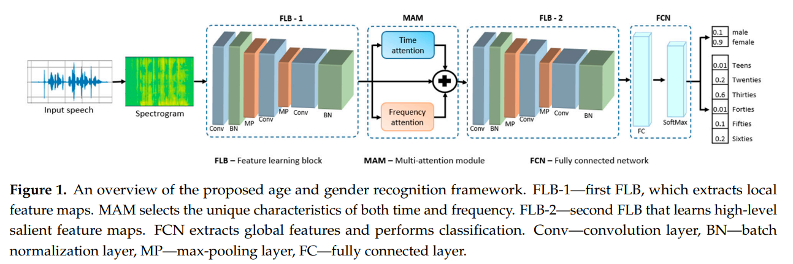

## Age-Gender-Classification

Official implementation of the paper titled **"Age and Gender Recognition Using a Convolutional Neural Network with a Specially Designed Multi-Attention Module through Speech Spectrograms"**. This implementation is for the Common Voice dataset. But it can be adjusted to any custom datasets. Paper can be downloaded from [here](https://www.mdpi.com/1424-8220/21/17/5892)

Introduction
----------------------------
Speech signals are being used as a primary input source in human–computer interaction (HCI) to develop several applications, such as automatic speech recognition (ASR), speech emotion
recognition (SER), gender, and age recognition. Classifying speakers according to their age and gender is a challenging task in speech processing owing to the disability of the current methods of extracting salient high-level speech features and classification models. To address these problems, we introduce a novel end-to-end age and gender recognition convolutional neural network (CNN) with a specially designed multi-attention module (MAM) from speech signals. Our proposed model uses MAM to extract spatial and temporal salient features from the input data effectively. The MAM mechanism uses a rectangular shape filter as a kernel in convolution layers and comprises two separate time and frequency attention mechanisms. The time attention branch learns to detect temporal cues, whereas the frequency attention module extracts the most relevant features to the target by focusing on the spatial frequency features. The combination of the two extracted spatial and temporal features complements one another and provide high performance in terms of age and gender classification. The proposed age and gender classification system was tested using the Common Voice and locally developed Korean speech recognition datasets. Our suggested model achieved 96%, 73%, and 76% accuracy scores for gender, age, and age-gender classification, respectively, using the Common Voice dataset. The Korean speech recognition dataset results were 97%, 97%, and 90% for gender, age, and age-gender recognition, respectively. The prediction performance of our proposed model, which was obtained in the experiments, demonstrated the superiority and robustness of the tasks regarding age, gender, and age-gender recognition from speech signals.



Installation
------------------------------
The proposed method is implemented using tensorflow in windows OS. Installing GPU version of the tensorflow is recommended.

### Example conda environment setup
```bash
conda create --name ag_cls python=3.8 -y
conda activate ag_cls
conda install -c conda-forge cudatoolkit=11.2 cudnn=8.1.0
# Anything above 2.10 is not supported on the GPU on Windows Native
python -m pip install "tensorflow<2.11"
pip install -r requirements.txt
```

Usage instructions
----------------------------------
First you need to download Common Voice dataset and put it inside `data/` folder. You can download either [raw](https://www.kaggle.com/datasets/mozillaorg/common-voice/data) dataset or [clean](https://1drv.ms/u/s!AtLl-Rpr0uJohKI71cVKzwcbo76FVg?e=vAar5G) dataset. It is recommended to download **clean** dataset. After downloading and extracting clean dataset into `data/` folder, the structure of the folder should be as following:
```bash
├──data/
│  └──CommonVoice/
│     ├──Audio/
│     │  ├──cv-valid-dev/
│     │  ├──cv-valid-test/
│     │  ├──cv-valid-train/
│     │  ├──LICENSE.txt
│     │  ├──README.txt
│     │  ├──cv-valid-dev.csv
│     │  ├──cv-valid-test.csv
│     │  └──cv-valid-train.csv
```

Dataset preparation
-------------------------------
Dataset preparation consists of 2 main steps. First, spectrograms are generated for each audio file and saved to `data/CommonVoice/Spectrograms/` folder. Second, `tfrecord` dataset is created and saved to `data/CommonVoice/TFRecord/` folder. To prepare dataset, you should use `src/preprocess_dataset.py` python script. You can run the script using the following command from the powershell terminal inside main repository folder:
```bash
# If you are preprocessing `raw` dataset then --dataset_type='raw' should be
python .\src\preprocess_dataset.py --dataset_dir='data/CommonVoice/' --dataset_type='clean'
```
After you completed the dataset preprocessing, your `data/` folder structure will be as following:

```bash
├───data/
│   └───CommonVoice/
│       ├───Audio/
│       │   ├───cv-valid-dev/
│       │   │   ├───sample-000004.mp3
│       │   │   ├───sample-000005.mp3
│       │   ├───cv-valid-test/
│       │   │   ├───sample-000001.mp3
│       │   │   ├───sample-000003.mp3
│       │   ├───cv-valid-train/
│       │   │   ├───sample-000005.mp3
│       │   │   ├───sample-000013.mp3
│       │   ├───LICENSE.txt
│       │   ├───README.txt
│       │   ├───cv-valid-dev.csv
│       │   ├───cv-valid-test.csv
│       │   └───cv-valid-train.csv
│       ├───Spectrograms/
│       │   ├───cv-valid-dev/
│       │   │   ├───sample-000004.png
│       │   │   ├───sample-000005.png
│       │   ├───cv-valid-test/
│       │   │   ├───sample-000001.png
│       │   │   ├───sample-000003.png
│       │   ├───cv-valid-train/
│       │   │   ├───sample-000005.png
│       │   │   ├───sample-000013.png
│       ├───TFRecord/
│       │   ├───cv-valid-dev/
│       │   │   ├───spec_data_000.tfrecord
│       │   │   ├───spec_data_001.tfrecord
│       │   ├───cv-valid-test/
│       │   │   ├───spec_data_000.tfrecord
│       │   │   ├───spec_data_001.tfrecord
│       │   └───cv-valid-train/
│       │   │   ├───spec_data_000.tfrecord
│       │   │   ├───spec_data_001.tfrecord
```

Model training
-------------------------------

To train model for age, gender, or gender_age classification, you can use `src/train.py` python script. Example code for using the `train.py` script is given below:

```bash
python .\src\train.py --dataset_dir='data/CommonVoice' --cls_task='age' --num_epochs=20 --show_live_plot=True
```

You can specify some other training parameters such as `--batch_size`, `--learning_rate`. Default value for `--batch_size` is 128 and for `--learning_rate` is 0.0001. There is also `--show_summary` parameter to show the model summary. Default value for `--show_summary` and `--show_live_plot` is False. After the training is finished, training log files are saved to `results/` folder depending on the classification task, and the best model is saved to `models/` folder. 


Model testing
-------------------------------
To test trained model, you can use `src/test.py` python script. The code example is given below:

```bash
python .\src\test.py --dataset_dir='data/CommonVoice' --model_path='models/age/best_model_age.h5' --cls_task='age'
```

Inference code
-------------------------------
To test trained model on a single audio file, you can use `src/inference.py` python script. The code example is given below:

```bash
python .\src\inference.py --model_path='models/age/best_model_age.h5' --audio_file='data/CommonVoice/Audio/cv-valid-test/sample-000001.mp3' --cls_task='age'
```